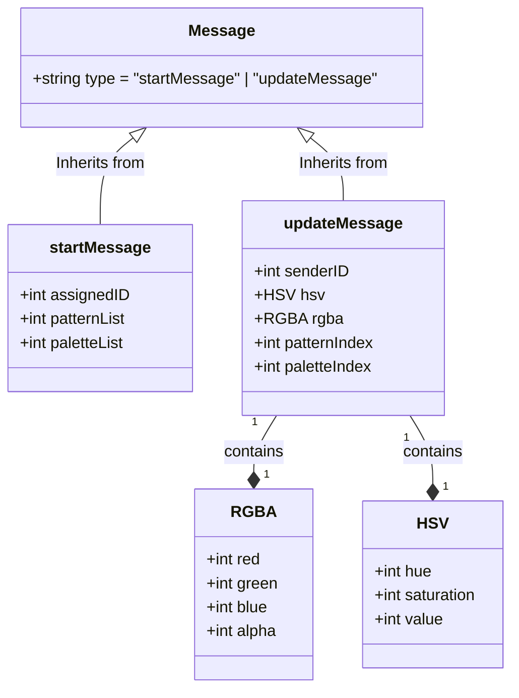

### Message Classes that used in communication between ESP8266 and Web clients.

```mermaid
classDiagram
    class Message {
        +string type = "startMessage" | "updateMessage"
    }

    class startMessage{
        +int assignedID
        +int patternList
        +int paletteList
    }

    class updateMessage{
        +int senderID
        +HSV hsv
        +RGBA rgba
        +int patternIndex
        +int paletteIndex
    }

    class RGBA {
        +int red
        +int green
        +int blue
        +int alpha
    }

    class HSV {
        +int hue
        +int saturation
        +int value
    }

    Message <|-- startMessage: Inherits from
    Message <|-- updateMessage: Inherits from

    updateMessage "1" --* "1" RGBA : contains
    updateMessage "1" --* "1" HSV : contains

```